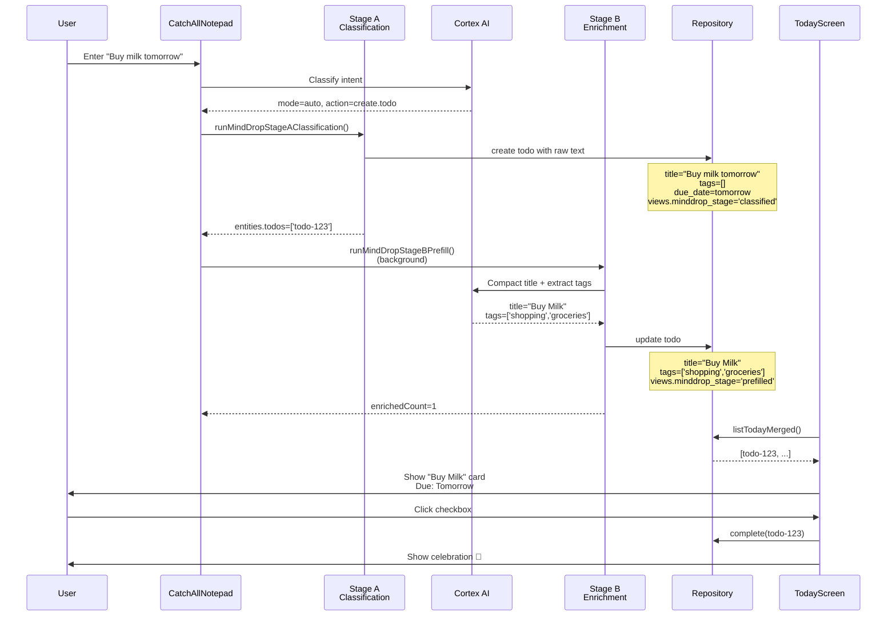
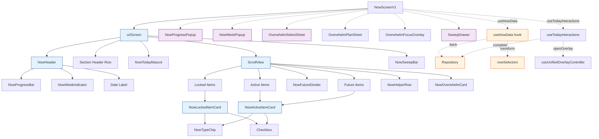

# Today/Now Page & Mind Drop Flow - Dependency Graph

**Generated:** November 26, 2025  
**Repository:** Gremly-mob2  
**Branch:** today-now-page-big-build

---

## STEP 1 — Today/Now Page Entry Points

### Main Entry: Router Pattern

**Primary File:** `app/tabs/TodayScreen.tsx`
- **Role:** Feature-flagged router that selects which Today variant to render
- **Exports:** `TodayScreen` (default export)
- **Routing Logic:**
  ```typescript
  if (env.feature.today.nowV1) return <NowScreenV1 />;        // Priority 1
  if (env.feature.today.v4Lanes) return <TodayV4LanesView />; // Priority 2
  if (env.feature.today.v3) return <TodayV3View />;           // Priority 3
  return <TodayScreenV2 />;                                   // Default/Fallback
  ```

**Variant Implementations:**
1. **`app/screens/NowScreenV1.tsx`** - NOW screen (feature flag: `EXPO_PUBLIC_NOW_V1=true`)
2. **`app/tabs/TodayV4LanesView.tsx`** - Today V4 Lanes variant
3. **`app/tabs/TodayV3View.tsx`** - Today V3 variant
4. **`TodayScreenV2()`** - Legacy Today V2 (inline in TodayScreen.tsx)

### Navigation Integration

**File:** `navigation/TabNavigator.tsx`
- Bottom tab navigator with 4 tabs
- **Tabs:** Today, Hub, Spaces, Me
- **Today Route:** `<Tab.Screen name="Today" component={TodayScreen} />`

---

## STEP 2 — UI Dependencies for Today/Now Page

### NowScreenV1 Component Tree

**Main File:** `app/screens/NowScreenV1.tsx`

#### Direct UI Imports:
```
NowScreenV1
├── ui/Screen.tsx                       → Base screen container
├── components/now/NowHeader.tsx        → Date/time, progress, week indicator
│   ├── NowProgressBar.tsx              → Progress visualization
│   ├── NowWeekIndicator.tsx            → Week number chip
│   └── NowWeeklySummary.tsx            → Weekly stats popup trigger
├── components/now/NowTodayMascot.tsx   → Mascot character
├── components/now/NowHelperRow.tsx     → Helper UI rows
├── components/now/NowLockedItemCard.tsx → Locked/pinned item cards
├── components/now/NowActiveItemCard.tsx → Active focus item cards
├── components/now/NowFutureDivider.tsx  → "Future" section divider
├── components/now/NowSweepBar.tsx       → Sweep prompt bar
├── components/now/NowProgressPopup.tsx  → Completed items popup
├── components/now/NowWeekPopup.tsx      → Weekly summary popup
├── components/now/OverwhelmSelectSheet.tsx → "Feeling overwhelmed" flow (step 1)
├── components/now/OverwhelmPlanSheet.tsx   → Overwhelm planning (step 2)
├── components/now/OverwhelmFocusOverlay.tsx → Overwhelm focus mode (step 3)
└── components/today/v3/SweepDrawer.tsx  → Sweep drawer overlay
```

#### Card Components Deep Dive:

**NowLockedItemCard** (locked/pinned items):
- Renders: Lock icon, item name, type chip, due time, checkbox
- Used for: Items manually pinned by user
- Checkbox: Triggers completion via `useTodayInteractions.toggleTodoComplete()` or `toggleHabitComplete()`

**NowActiveItemCard** (active focus items):
- Renders: Item name, type chip, cadence label (e.g., "2/3 this week"), checkbox
- Used for: Items due today/this week
- Checkbox: Triggers completion

**Item Type Chips:**
- `components/now/NowTypeChip.tsx` - Shows "To-do", "Habit", "Log"

#### Progress Components:

**NowHeader:**
- Displays: Date/time, week indicator, progress percentage
- Triggers: `onPressProgress` → opens `NowProgressPopup`
- Triggers: `onPressWeek` → opens `NowWeekPopup`

**NowProgressBar:**
- Visual: Horizontal bar showing % completion
- Data: `progressPercent` from `useNowData()`

**NowWeekIndicator:**
- Displays: "WEEK: 48" (current week number)
- Click: Opens weekly summary

**NowWeeklySummary:**
- Displays: Habit completion stats for the week
- Shows: "This week: 15 of 21 habits completed"

#### Overwhelm Flow Components:

1. **OverwhelmSelectSheet** - Select overwhelming items (bottom sheet)
2. **OverwhelmPlanSheet** - Plan resolution (bottom sheet)
3. **OverwhelmFocusOverlay** - Focus mode (full screen overlay)

State managed by: `lib/now/useOverwhelmFlow.ts`

### TodayScreenV2 Component Tree

**Main File:** `app/tabs/TodayScreen.tsx` (function TodayScreenV2)

#### Direct UI Imports:
```
TodayScreenV2
├── ui/Screen.tsx                           → Base screen container
├── ui/Box.tsx                              → Layout component
├── ui/Text.tsx                             → Text component
├── ui/Button.tsx                           → Button component
├── design-system/Card.tsx                  → Card container
├── components/today/TodayMascotHeader.tsx  → Mascot header with greeting
│   ├── Shows: Greeting, subline, streak count
│   └── Props: greeting, subline, streakCount, completedToday, plannedToday
├── components/today/TodaySection.tsx       → Collapsible section
│   ├── Props: title, initiallyExpanded, onExpandedChange, footer, limit
│   └── Renders: Section header with chevron, collapsible content
├── components/today/TodayHabitCard.tsx     → Habit card with checkbox
│   ├── Shows: Habit name, due window, streak, space, tags
│   └── Actions: onComplete, onLongPress
├── components/today/TodayTodoCard.tsx      → Todo card with checkbox
│   ├── Shows: Todo title, due time, space, tags, overdue badge
│   └── Actions: onComplete, onLongPress
├── components/today/TodaySuggestionCard.tsx → Suggestion card
│   ├── Shows: Title, reason, CTA button
│   └── Actions: onPress (opens prefilled overlay)
├── components/today/TodayCelebrationOverlay.tsx → Celebration modal
│   ├── Shows: Confetti animation, "Great work!" message
│   └── Actions: onUndo, onRequestClose
└── components/overlay/UnifiedCreateOverlay.tsx → Unified create/edit overlay
    ├── Modes: create, edit, view
    └── Entities: todo, habit, note, log, list, person
```

#### Progress/Header Components:

**TodayMascotHeader:**
- Displays: Time-of-day greeting, motivational subline, streak count
- Shows progress: "3 of 8 completed today"
- Mascot: Animated character (conditionally rendered)

**TodaySection:**
- Sections: "Habits Today", "Due Today", "Suggested"
- Collapsible: User can expand/collapse per session
- "Show N more" button if items capped at MAX_VISIBLE (5)

#### Card Interactions:

**Checkbox Behavior:**
- Click checkbox → `handleHabitComplete()` or `handleTodoComplete()`
- Optimistic UI: Immediate visual feedback
- Toast: "Great work!" with undo button
- Undo window: 3 seconds
- Celebration: Optional overlay (feature flag)

**Long Press:**
- Opens: `UnifiedCreateOverlay` in edit mode
- Allows: Editing name, tags, due date, space, etc.

### Shared Components (Both NOW and Today)

**From `ui/`:**
- `Screen.tsx` - Base screen wrapper with safe area
- `Box.tsx` - Flexbox layout primitive
- `Text.tsx` - Text with theme variants
- `Button.tsx` - Button with variants (primary, neutral, ghost)
- `Input.tsx` - Text input

**From `design-system/`:**
- `Card.tsx` - Card container with elevation
- `Icon.tsx` - Icon component (lucide-react-native)
- `Button.tsx` - Enhanced button (used in Today V2)
- `Badge.tsx` - Badge/chip component

**From `components/overlay/`:**
- `UnifiedCreateOverlay.tsx` - Main overlay (used by Today V2)
- `UnifiedOverlayV2.tsx` - V2 implementation (not directly used, but related)

---

## STEP 3 — Data Piping Dependencies

### NOW Screen Data Flow

**Primary Hook:** `lib/now/useNowData.ts`

#### Data Structure:
```typescript
interface NowData {
  greeting: string                    // "Good morning", "Good afternoon", etc.
  dateTimeLabel: string              // "Monday, November 25"
  progressState: NowProgressState    // { completed, total, percent }
  weekStatus: WeekStatus             // "ahead" | "on_track" | "needs_attention"
  lockedItems: NowLockedItem[]       // Manually pinned items
  activeItems: NowActiveItem[]       // Due today/this week
  futureItems: NowFutureItem[]       // Future due items
  vaultSummary: MindVaultSummary     // Recent captures stats
  completedToday: NowCompletedItem[] // Completed today
  hasYesterdayCarryOver: boolean     // Sweep needed
  weeklySummaries: NowWeeklyHabitSummary[] // Weekly habit stats
  weekHealth: NowWeekHealth          // Week health score
  capturesCount: number              // Last 7 days captures
  loading: boolean
}
```

#### Data Dependencies:

**useNowData Hook:**
```
useNowData()
├── useRepo()                           → IRepo interface
├── useAuth()                           → User ID
├── Fetches:
│   ├── repo.listTodos()                → All todos
│   ├── repo.listHabits()               → All habits
│   ├── repo.listTodayMerged()          → Today's items (optimized query)
│   └── repo.query({ type: 'note', ... }) → Recent notes (7 days)
├── Selectors (lib/now/nowSelectors.ts):
│   ├── getLockedItems()                → Filter locked items
│   ├── getActiveTodayItems()           → Filter due today/this week
│   ├── getFutureItems()                → Filter future items
│   ├── getProgressEligibleItems()      → Items eligible for progress
│   ├── getProgressState()              → Calculate completion %
│   ├── getCompletedTodayItems()        → Today's completed items
│   ├── getMindVaultSummary()           → Recent captures summary
│   ├── getWeeklyHabitSummaries()       → Habit weekly stats
│   ├── computeWeekHealth()             → Week health score
│   └── getWeeklyCaptureCounts()        → Capture counts (7 days)
└── Utilities:
    ├── getGreeting()                   → Time-of-day greeting
    ├── formatDateTime()                → Date formatting
    └── calculateWeekStatus()           → Week status logic
```

**Key Selectors Explained:**

1. **getLockedItems()**
   - Input: todos, habits
   - Filter: `item.locked === true`
   - Sort: By lock order
   - Output: NowLockedItem[]

2. **getActiveTodayItems()**
   - Input: todos, habits, completionHistory
   - Filter:
     - Todos: due_date is today OR overdue
     - Habits: due today based on cadence (daily/weekly/monthly)
   - Exclude: Locked items, completed items
   - Output: NowActiveItem[]

3. **getFutureItems()**
   - Input: todos, habits
   - Filter: due_date > today
   - Output: NowFutureItem[]

4. **getProgressState()**
   - Input: eligibleItems, completedToday
   - Calculation:
     - total = eligibleItems.length
     - completed = completedToday.filter(in eligibleItems).length
     - percent = (completed / total) * 100
   - Output: { completed, total, percent }

5. **getMindVaultSummary()**
   - Input: notes (recent 7 days)
   - Groups by:
     - Lists (note_subtype: 'list', 'project', 'everything_else')
     - Journals (note_subtype: 'journal')
     - Ideas (note_subtype: 'idea')
   - Output: { listCount, journalCount, ideaCount, overflowCount }

6. **getWeeklyHabitSummaries()**
   - Input: habits, completionHistory
   - For each habit:
     - Calculate: completedThisWeek, targetPerWeek
     - Determine: status (week_complete, on_track, last_chance)
   - Output: NowWeeklyHabitSummary[]

7. **calculateWeekStatus()**
   - Input: weeklyHabitSummaries
   - Logic:
     - ahead: >80% habits complete
     - on_track: 50-80% complete
     - needs_attention: <50% complete
   - Output: "ahead" | "on_track" | "needs_attention"

### Today V2 Data Flow

**Primary Hook:** `lib/today/useTodayData.ts`

#### Data Structure:
```typescript
interface TodayData {
  timeWindow: TimeWindow             // "morning" | "midday" | "evening"
  header: {
    greeting: string                 // "Good morning, James"
    subline: string                  // "Let's make today count"
    streakCount: number              // Current streak
    completedToday: number           // # completed today
    plannedToday: number             // # planned today
  }
  habits: EnrichedHabit[]            // All due today
  todos: EnrichedTodo[]              // All due today
  suggestions: Suggestion[]          // AI-generated suggestions
  commitments: TodayCommitment[]     // User commitments
  visible: {                         // Capped for UI
    habits: EnrichedHabit[]          // Max 5
    todos: EnrichedTodo[]            // Max 5
    suggestions: Suggestion[]        // Max 3
  }
  hidden: {                          // Overflow counts
    habits: number
    todos: number
    suggestions: number
  }
  reducedMotion: boolean
  loading: boolean
  error: string | null
}
```

#### Data Dependencies:

**useTodayData Hook:**
```
useTodayData()
├── useRepo()                           → IRepo interface
├── useAuth()                           → User ID
├── useReducedMotion()                  → Accessibility preference
├── Fetches:
│   ├── repo.listTodayMerged()          → Optimized query for today's items
│   ├── repo.query({ type: 'commitment' }) → User commitments
│   └── Event listeners:
│       └── eventBus.on('overlay:saved') → Reload on entity save
├── Processing:
│   ├── filterDueToday(todos)           → Todos due today/overdue
│   ├── filterDueToday(habits)          → Habits due today
│   ├── enrichWithSpaceNames()          → Join space names
│   ├── sortByPriority()                → Sort by due time, overdue
│   ├── capVisibleItems()               → Limit to MAX_VISIBLE (5)
│   └── generateSuggestions()           → AI-powered suggestions
└── Utilities:
    ├── getGreeting()                   → Time-of-day greeting
    ├── getMascotSubline()              → Motivational subline
    └── calculateStreak()               → Calculate completion streak
```

**Suggestion Generation:**
- **File:** `lib/today/useTodayData.ts` (lines 200-300)
- **Logic:**
  - Evening journal (18:00+, no journal today) → "Reflect on your day"
  - Prep for tomorrow (18:00+, 0 todos tomorrow) → "Plan tomorrow"
  - Weekly review (Sunday, incomplete habits) → "Review this week"
- **Output:** `Suggestion[]` with prefill payloads for overlay

### Repository Layer (Data Persistence)

**Interface:** `lib/repo/IRepo.ts`

#### Key Methods Used by Today/NOW:

```typescript
interface IRepo {
  // Queries
  listTodos(filter?: TodoFilter): Promise<Todo[]>
  listHabits(filter?: HabitFilter): Promise<Habit[]>
  listTodayMerged(): Promise<AppRecord[]>  // Optimized: todos + habits for today
  query(params: QueryParams): Promise<AppRecord[]>
  
  // Mutations
  update(params: UpdateParams): Promise<AppRecord>
  complete(id: string, type: CanonicalType): Promise<void>
  uncomplete(id: string, type: CanonicalType): Promise<void>
  
  // Completion history
  getHabitCompletionHistory(habitId: string): Promise<number[]>
  
  // Specialized
  findTodoByDropId(dropId: string): Promise<Todo | null>
  findHabitByDropId(dropId: string): Promise<Habit | null>
}
```

**Implementations:**
- `lib/repo/supabase.ts` - Production (Supabase client)
- `lib/repo/memory.ts` - Testing (in-memory store)

**Provider:** `providers/RepoProvider.tsx`
- Context: `RepoContext`
- Hook: `useRepo()`
- Initialization: Selects backend (Supabase vs Memory) based on env

#### Supabase Queries:

**listTodayMerged()** (optimized):
```sql
SELECT * FROM records
WHERE user_id = $1
  AND type IN ('todo', 'habit')
  AND (
    (type = 'todo' AND due_date <= CURRENT_DATE)
    OR (type = 'habit' AND cadence = 'daily')
    OR (type = 'habit' AND cadence = 'weekly' AND ... week logic ...)
  )
  AND archived = false
ORDER BY due_date ASC, created_at DESC
```

**getHabitCompletionHistory()**:
```sql
SELECT completion_history FROM records
WHERE id = $1 AND type = 'habit'
```
- Returns: `number[]` (timestamps of completions)
- Used for: Weekly progress calculation

### Shared Interaction Logic

**Hook:** `lib/today/useTodayInteractions.ts`
- **Used by:** Both NowScreenV1 AND TodayScreenV2
- **Purpose:** Centralized interaction handlers (DRY principle)

#### Provided Functions:

```typescript
useTodayInteractions({
  onReload?: () => Promise<void>,
  celebrationEnabled?: boolean,
  onCelebration?: () => void,
}) → {
  // Overlay control
  openEntityOverlay: (item) => void,
  
  // Completions with undo
  toggleTodoComplete: (todo) => Promise<void>,
  toggleHabitComplete: (habit) => Promise<void>,
  
  // Undo state
  undoState: UndoState | null,
  handleUndo: () => void,
  
  // Optimistic UI state
  completedHabitIds: Set<string>,
  completedTodoIds: Set<string>,
}
```

#### Undo Flow:

1. User clicks checkbox
2. Optimistic UI: Add to `completedTodoIds` set
3. Show undo banner: "Marked 'X' complete. [Undo]"
4. Start 3-second timer
5. After 3 seconds: Persist to database via `repo.complete()`
6. If undo: Cancel timer, remove from set, refresh

---

## STEP 4 — Navigation & Overlay Dependencies

### Route Definitions

**File:** `navigation/RootNavigator.tsx`

```typescript
export type RootStackParamList = {
  Tabs: undefined;                        // Main tab navigator
  CatchAllNotepad: undefined;             // Mind Drop screen
  SpaceHome: { spaceId: string };         // Space detail
  ChatThread: { spaceId: string; chatId: string };
  Lists: undefined;                       // Lists screen
  PersonDetail: { personName: string; personEmail?: string };
  SpaceDetail: { id: string };            // Legacy space detail
  // Dev screens: DSPreview, DevLogin, RecentItems
};
```

**Stack Navigator:**
```
RootNavigator
├── Tabs (TabNavigator)               → Default screen
│   ├── Today (TodayScreen)           → Entry point for Today/NOW
│   ├── Hub (HubScreen)
│   ├── Spaces (SpacesScreen)
│   └── Me (MeScreen)
├── CatchAllNotepad                    → Mind Drop screen
├── SpaceHome                          → Space detail v2
├── ChatThread                         → Space chat thread
├── Lists                              → Lists management
└── PersonDetail                       → Person profile
```

### Overlay System

**Controller:** `hooks/useUnifiedOverlayController.ts`

#### Overlay Modes:
- **create** - Create new entity
- **edit** - Edit existing entity
- **view** - View entity (read-only)

#### Supported Entity Types:
- todo
- habit
- note
- log
- list
- person

#### Controller API:

```typescript
useUnifiedOverlayController() → {
  state: {
    visible: boolean,
    mode: 'create' | 'edit' | 'view',
    initialEntity: { type, id, ... } | null,
    initialSpaceId: string | null,
  },
  
  // Open methods
  openCreate: (options?: CreateOptions) => void,
  openEdit: (options: EditOptions) => void,
  openView: (options: ViewOptions) => void,
  
  // Close
  close: () => void,
}
```

**CreateOptions:**
```typescript
{
  type?: CanonicalType,               // Pre-select entity type
  spaceId?: string | null,            // Pre-select space
  logSubtype?: LogSubtype | null,     // Pre-select log subtype
  initialText?: string | null,        // Prefill text input
  conversionMeta?: {                  // Metadata for converted entities
    origin?: string,
    ai_placed?: boolean,
    initialTitle?: string,
    initialNote?: string,
    initialDueDate?: string | null,
  },
  suppressOverlayOpen?: boolean,      // Create without showing overlay
}
```

#### Overlay Components:

**File:** `components/overlay/UnifiedCreateOverlay.tsx`
- Mode: create, edit, view
- Tabs: Todos, Habits, Journal, Notes, Person
- Features:
  - Type selector pills
  - Title/name input
  - Due date picker (todos)
  - Frequency selector (habits)
  - Space selector
  - Tag editor
  - Reminder selector
  - Delete button (edit mode)

**File:** `components/overlay/UnifiedOverlayV2.tsx`
- Enhanced version with:
  - AI prefill (`useOverlayPrefill`)
  - Mind Drop integration
  - Conversion metadata handling

### Overlays Accessed from Today/NOW

1. **UnifiedCreateOverlay** (create/edit entity)
   - Trigger: "Add More" button, long press card, suggestion card
   - Opens: Via `useUnifiedOverlayController().openCreate()` or `.openEdit()`

2. **NowProgressPopup** (completed items list)
   - Trigger: Click progress bar in NowHeader
   - Shows: List of completed items today with timestamps
   - Component: `components/now/NowProgressPopup.tsx`

3. **NowWeekPopup** (weekly summary)
   - Trigger: Click week indicator in NowHeader
   - Shows: Habit completion stats for current week
   - Component: `components/now/NowWeekPopup.tsx`

4. **OverwhelmSelectSheet** (overwhelm flow step 1)
   - Trigger: Click "Feeling overwhelmed?" button
   - Shows: Bottom sheet to select overwhelming items
   - Component: `components/now/OverwhelmSelectSheet.tsx`

5. **OverwhelmPlanSheet** (overwhelm flow step 2)
   - Trigger: After selecting items in step 1
   - Shows: Bottom sheet to plan resolution
   - Component: `components/now/OverwhelmPlanSheet.tsx`

6. **OverwhelmFocusOverlay** (overwhelm flow step 3)
   - Trigger: After planning in step 2
   - Shows: Full-screen focus mode
   - Component: `components/now/OverwhelmFocusOverlay.tsx`

7. **SweepDrawer** (sweep mode)
   - Trigger: Click sweep bar (yesterday carryover)
   - Shows: Drawer to process yesterday's items
   - Component: `components/today/v3/SweepDrawer.tsx`

8. **TodayCelebrationOverlay** (celebration)
   - Trigger: Complete item (feature flag enabled)
   - Shows: Confetti animation, "Great work!" message
   - Component: `components/today/TodayCelebrationOverlay.tsx`

---

## STEP 5 — Mind Drop Flow Dependencies

### Mind Drop Screen

**Main File:** `app/screens/CatchAllNotepad.tsx` (5,415 lines)

#### Purpose:
- User input for unstructured text
- AI classification (Stage A)
- Entity creation (todos, habits, notes)
- Background enrichment (Stage B)

#### Component Imports:

```
CatchAllNotepad
├── ui/Text.tsx                         → Text component
├── design-system/Icon.tsx              → Icons (Lucide)
├── components/minddrop/MidConfidenceChips.tsx → Category selection chips
├── components/common/ConfirmationPill.tsx → Success/error feedback
├── components/MascotIcon.tsx           → Mascot character
└── Assets:
    ├── assets/mascot/ACTUAL GREMLY.png → Mascot image
    └── assets/minddrop_header-removebg.png → Mind Drop header
```

#### Key UI Elements:

1. **Header:** Mind Drop branding image
2. **Input Area:** TextInput for user text
3. **Thinking Animation:** "Organizing your thoughts…" (1.2s)
4. **Category Chips:** Todo, Habit, Note, Log (mid-confidence)
5. **Timing Chips:** Today, Tomorrow, This Week, Custom (mid-confidence)
6. **Recent Drops:** List of recent Mind Drop items
7. **Confirmation Pill:** Success/error feedback

### Mind Drop Pipeline Architecture

**Two-Stage Pipeline:**

#### Stage A: Classification & Entity Creation

**File:** `lib/minddrop/pipelineStages.ts`

**Function:** `runMindDropStageAClassification()`

**Input:**
```typescript
{
  repo: IRepo,
  text: string,                    // User input
  cleanedText: string,             // Normalized text
  decision: CortexResponse,        // AI classification result
  dropId: string,                  // Unique drop ID
  sourceMessageId?: string,        // Source chat message
  parsedDue?: string,              // Extracted due date
  unsortedNoteId?: string,         // Temp note ID
}
```

**Process:**
1. Parse `decision.actions[0]` (first action from AI)
2. Determine entity type: `create.todo`, `create.habit`, `create.note`
3. Call conversion function:
   - `convertUnsortedToTodo()` - Creates todo
   - `convertUnsortedToHabit()` - Creates habit
   - Creates note (direct)
4. Set metadata:
   - `views.minddrop_stage = 'classified'`
   - `views.ai_pending = true` (waiting for Stage B)
   - `views.ai_failed = false`
5. Handle idempotency (check for existing entity by `dropId`)

**Output:**
```typescript
{
  entities: {
    todos: string[],        // IDs of created todos
    habits: string[],       // IDs of created habits
    notes: string[],        // IDs of created notes
  },
  entityDetails: Array<{
    kind: 'todo' | 'habit' | 'note',
    noteSubtype?: string,
  }>,
  mode: 'auto' | 'ask' | 'ambiguous' | 'keep' | 'reply',
  confidence: number,
}
```

**Dependencies:**
```
runMindDropStageAClassification()
├── lib/conversion/convertUnsortedToTodo.ts  → Todo conversion
├── lib/conversion/convertUnsortedToHabit.ts → Habit conversion
├── repo.create()                             → Database insert
├── repo.update()                             → Update metadata
├── repo.findTodoByDropId()                   → Idempotency check
└── repo.findHabitByDropId()                  → Idempotency check
```

#### Stage B: AI Enrichment (Background)

**File:** `lib/minddrop/backgroundPrefill.ts`

**Function:** `backgroundPrefill()`

**Input:**
```typescript
{
  entityIds: {
    todos: string[],
    habits: string[],
    notes: string[],
  },
  rawText: string,          // Original user input
  repo: IRepo,
}
```

**Process:**
1. For each entity:
   - Call Cortex for title compaction
   - Extract tags from text
   - Determine note subtypes (journal, idea, list, etc.)
2. Update entity:
   - `title` - Compacted (e.g., "Book doctor tomorrow 2pm" → "Doctor Appointment")
   - `tags` - Extracted (e.g., ['doctor', 'appointment'])
   - `note_subtype` - Classified (for notes/logs)
   - `views.minddrop_stage = 'prefilled'`
   - `views.minddrop_prefilled_v1 = true`
   - `views.ai_title_frozen = true` (prevent re-enrichment)
   - `views.ai_tags_frozen = true`

**Output:**
```typescript
{
  enrichedCount: number,    // # successfully enriched
  failures: string[],       // IDs that failed
}
```

**Dependencies:**
```
backgroundPrefill()
├── lib/cortex/cortexDecide.ts              → AI title compaction
├── lib/tags/extractTags.ts                 → Tag extraction
├── lib/tags/normalize.ts                   → Tag normalization
├── lib/minddrop/normalizeTodoTitle.ts      → Title normalization
├── lib/minddrop/logSubtypeTags.ts          → Log subtype detection
└── repo.update()                            → Database update
```

**Orchestration:**
- **File:** `lib/minddrop/pipelineStages.ts`
- **Function:** `runMindDropStageBPrefill()`
- **Wrapper:** Calls `backgroundPrefill()` for each entity type

### Cortex AI Classification

**File:** `lib/cortex/cortexDecide.ts`

**Function:** `cortexDecide()`

**Input:**
```typescript
{
  text: string,                    // User input
  context?: CortexContext,         // Optional context (space, recent items)
  model?: string,                  // AI model (default: gpt-4o-mini)
  timeoutMs?: number,              // Timeout (default: 15000)
}
```

**Process:**
1. Send request to Cortex Worker (Cloudflare)
2. AI analyzes text and determines intent
3. Returns classification + suggested actions

**Output:**
```typescript
{
  mode: 'auto' | 'ask' | 'ambiguous' | 'keep' | 'reply',
  confidence: number,              // 0-1 confidence score
  actions: CortexAction[],         // Suggested actions
  explanation?: string,            // Why this classification
  reply?: string,                  // Reply text (mode: reply)
}
```

**CortexAction Types:**
```typescript
{
  type: 'create.todo' | 'create.habit' | 'create.note' | 'add.to.list',
  payload: {
    title?: string,
    due?: string,                  // ISO date
    freq?: 'daily' | 'weekly',    // Habit frequency
    note_subtype?: string,         // Note classification
  }
}
```

**Dependencies:**
```
cortexDecide()
├── fetch(CORTEX_WORKER_URL)                → Cloudflare Worker
├── lib/cortex/router.ts                    → Route to correct worker
└── lib/env.ts                              → Configuration
```

**Environment Variables:**
- `EXPO_PUBLIC_CORTEX_URL` - Worker URL
- `EXPO_PUBLIC_CORTEX_MODEL` - AI model
- `EXPO_PUBLIC_CORTEX_TIMEOUT_MS` - Request timeout
- `EXPO_PUBLIC_CORTEX_CLASSIFY_CATCHALL` - Enable classification

### Conversion Functions

**Directory:** `lib/conversion/`

**convertUnsortedToTodo():**
- Input: unsortedNoteId, repo, options (due date)
- Process:
  1. Fetch unsorted note
  2. Create new todo record
  3. Copy: body → title, body, tags, dropId
  4. Set: due_date, origin='catchall', labels=['catchall']
  5. Archive unsorted note
- Output: { todo: Todo }

**convertUnsortedToHabit():**
- Input: unsortedNoteId, repo, options (frequency)
- Process:
  1. Fetch unsorted note
  2. Create new habit record
  3. Copy: body → name, body, tags, dropId
  4. Set: frequency='daily'|'weekly', origin='catchall'
  5. Archive unsorted note
- Output: { habit: Habit }

**convertUnsortedToLog():**
- Similar to above, but creates log instead

### Shared Components (Mind Drop ↔ Today)

**1. UnifiedOverlayV2**
- Used by: Mind Drop (edit items), Today (create/edit items)
- Integration: `useOverlayPrefill()` hook for AI enrichment
- File: `components/overlay/UnifiedOverlayV2.tsx`

**2. Repository Layer**
- Used by: Both for all data operations
- Interface: `lib/repo/IRepo.ts`
- Provider: `providers/RepoProvider.tsx`

**3. Cortex AI**
- Used by: Mind Drop (classification), Today (suggestions)
- Provider: `providers/CortexProvider.tsx`
- Client: `lib/cortex/cortexDecide.ts`

**4. Event Bus**
- Used by: Both for cross-component communication
- File: `lib/events/EventBus.ts`
- Events: `overlay:saved`, `entity:deleted`

**5. Interaction Hook**
- Used by: Today screens for item completion
- File: `lib/today/useTodayInteractions.ts`
- Shared: Completion logic, undo state

**6. Action Toast**
- Used by: Mind Drop (success feedback), Today (optional)
- Hook: `src/hooks/useActionToast.tsx`
- Shows: Inline toasts with actions

---

## STEP 6 — Dependency Graph

### High-Level Outline

```
├── NAVIGATION LAYER
│   ├── navigation/RootNavigator.tsx
│   │   └── navigation/TabNavigator.tsx
│   │       └── app/tabs/TodayScreen.tsx (Router)
│   │           ├── app/screens/NowScreenV1.tsx (NOW V1)
│   │           ├── app/tabs/TodayV4LanesView.tsx (Today V4)
│   │           ├── app/tabs/TodayV3View.tsx (Today V3)
│   │           └── TodayScreenV2() (Today V2 - Legacy)
│   └── navigation/RootNavigator.tsx
│       └── app/screens/CatchAllNotepad.tsx (Mind Drop)
│
├── UI COMPONENTS LAYER
│   ├── NOW Components (components/now/*)
│   │   ├── NowHeader.tsx
│   │   ├── NowLockedItemCard.tsx
│   │   ├── NowActiveItemCard.tsx
│   │   ├── NowProgressPopup.tsx
│   │   ├── NowWeekPopup.tsx
│   │   ├── OverwhelmSelectSheet.tsx
│   │   ├── OverwhelmPlanSheet.tsx
│   │   └── OverwhelmFocusOverlay.tsx
│   │
│   ├── Today Components (components/today/*)
│   │   ├── TodayMascotHeader.tsx
│   │   ├── TodaySection.tsx
│   │   ├── TodayHabitCard.tsx
│   │   ├── TodayTodoCard.tsx
│   │   ├── TodaySuggestionCard.tsx
│   │   └── TodayCelebrationOverlay.tsx
│   │
│   ├── Mind Drop Components (components/minddrop/*)
│   │   └── MidConfidenceChips.tsx
│   │
│   ├── Overlay Components (components/overlay/*)
│   │   ├── UnifiedCreateOverlay.tsx
│   │   └── UnifiedOverlayV2.tsx
│   │
│   └── Shared UI (ui/*, design-system/*)
│       ├── Screen.tsx
│       ├── Box.tsx
│       ├── Text.tsx
│       ├── Button.tsx
│       ├── Card.tsx
│       └── Icon.tsx
│
├── DATA LAYER
│   ├── NOW Data
│   │   ├── lib/now/useNowData.ts
│   │   ├── lib/now/nowSelectors.ts
│   │   └── lib/now/useOverwhelmFlow.ts
│   │
│   ├── Today Data
│   │   ├── lib/today/useTodayData.ts
│   │   └── lib/today/hooks/*
│   │       ├── useFocusCard.ts
│   │       ├── useCommitments.ts
│   │       └── useTodayEntries.ts
│   │
│   ├── Shared Interactions
│   │   └── lib/today/useTodayInteractions.ts
│   │
│   └── Repository Layer
│       ├── lib/repo/IRepo.ts (interface)
│       ├── lib/repo/supabase.ts (implementation)
│       └── providers/RepoProvider.tsx (context)
│
├── MIND DROP PIPELINE
│   ├── lib/minddrop/pipelineStages.ts
│   │   ├── runMindDropStageAClassification()
│   │   └── runMindDropStageBPrefill()
│   │
│   ├── lib/minddrop/backgroundPrefill.ts
│   ├── lib/conversion/*
│   │   ├── convertUnsortedToTodo.ts
│   │   ├── convertUnsortedToHabit.ts
│   │   └── convertUnsortedToLog.ts
│   │
│   └── lib/cortex/cortexDecide.ts (AI classification)
│
├── OVERLAY SYSTEM
│   ├── hooks/useUnifiedOverlayController.ts
│   └── components/overlay/useOverlayPrefill.ts
│
└── INFRASTRUCTURE
    ├── providers/AuthProvider.tsx
    ├── providers/RepoProvider.tsx
    ├── lib/events/EventBus.ts
    ├── lib/env.ts
    └── src/hooks/useActionToast.tsx
```

### Mermaid Dependency Graph

```mermaid
graph TD
    %% Navigation Layer
    RootNav[navigation/RootNavigator.tsx]
    TabNav[navigation/TabNavigator.tsx]
    TodayRouter[app/tabs/TodayScreen.tsx<br/>Router]
    
    %% Screen Variants
    NowScreen[app/screens/NowScreenV1.tsx<br/>NOW V1]
    TodayV4[app/tabs/TodayV4LanesView.tsx<br/>Today V4]
    TodayV3[app/tabs/TodayV3View.tsx<br/>Today V3]
    TodayV2[TodayScreenV2<br/>Today V2 Legacy]
    MindDrop[app/screens/CatchAllNotepad.tsx<br/>Mind Drop]
    
    %% Data Hooks
    UseNowData[lib/now/useNowData.ts]
    UseTodayData[lib/today/useTodayData.ts]
    UseTodayInteractions[lib/today/useTodayInteractions.ts]
    UseOverwhelm[lib/now/useOverwhelmFlow.ts]
    
    %% Selectors
    NowSelectors[lib/now/nowSelectors.ts]
    
    %% Repository
    IRepo[lib/repo/IRepo.ts<br/>Interface]
    Supabase[lib/repo/supabase.ts<br/>Implementation]
    RepoProvider[providers/RepoProvider.tsx]
    
    %% NOW Components
    NowHeader[components/now/NowHeader.tsx]
    NowCards[components/now/Now*ItemCard.tsx]
    NowPopups[components/now/NowProgressPopup.tsx<br/>NowWeekPopup.tsx]
    OverwhelmFlow[components/now/Overwhelm*.tsx<br/>Select/Plan/Focus]
    
    %% Today Components
    TodayHeader[components/today/TodayMascotHeader.tsx]
    TodayCards[components/today/Today*Card.tsx<br/>Habit/Todo/Suggestion]
    TodaySection[components/today/TodaySection.tsx]
    Celebration[components/today/TodayCelebrationOverlay.tsx]
    
    %% Overlay System
    OverlayController[hooks/useUnifiedOverlayController.ts]
    UnifiedOverlay[components/overlay/UnifiedCreateOverlay.tsx]
    OverlayV2[components/overlay/UnifiedOverlayV2.tsx]
    OverlayPrefill[components/overlay/useOverlayPrefill.ts]
    
    %% Mind Drop Pipeline
    StageA[lib/minddrop/pipelineStages.ts<br/>Stage A: Classification]
    StageB[lib/minddrop/backgroundPrefill.ts<br/>Stage B: Enrichment]
    Cortex[lib/cortex/cortexDecide.ts<br/>AI Classification]
    Conversion[lib/conversion/*<br/>Entity Conversion]
    MindDropChips[components/minddrop/MidConfidenceChips.tsx]
    
    %% Shared
    EventBus[lib/events/EventBus.ts]
    AuthProvider[providers/AuthProvider.tsx]
    
    %% Navigation Flow
    RootNav --> TabNav
    RootNav --> MindDrop
    TabNav --> TodayRouter
    TodayRouter -->|flag: nowV1| NowScreen
    TodayRouter -->|flag: v4Lanes| TodayV4
    TodayRouter -->|flag: v3| TodayV3
    TodayRouter -->|default| TodayV2
    
    %% NOW Screen Dependencies
    NowScreen --> UseNowData
    NowScreen --> UseTodayInteractions
    NowScreen --> UseOverwhelm
    NowScreen --> NowHeader
    NowScreen --> NowCards
    NowScreen --> NowPopups
    NowScreen --> OverwhelmFlow
    NowScreen --> OverlayController
    
    %% Today V2 Dependencies
    TodayV2 --> UseTodayData
    TodayV2 --> UseTodayInteractions
    TodayV2 --> TodayHeader
    TodayV2 --> TodayCards
    TodayV2 --> TodaySection
    TodayV2 --> Celebration
    TodayV2 --> OverlayController
    
    %% Data Layer
    UseNowData --> RepoProvider
    UseNowData --> NowSelectors
    UseNowData --> AuthProvider
    UseTodayData --> RepoProvider
    UseTodayData --> AuthProvider
    UseTodayData --> EventBus
    
    %% Interactions
    UseTodayInteractions --> RepoProvider
    UseTodayInteractions --> OverlayController
    UseTodayInteractions --> EventBus
    
    %% Selectors
    NowSelectors --> IRepo
    
    %% Repository Layer
    RepoProvider --> Supabase
    Supabase --> IRepo
    
    %% Overlay System
    OverlayController --> OverlayV2
    TodayV2 --> UnifiedOverlay
    UnifiedOverlay --> OverlayPrefill
    OverlayV2 --> OverlayPrefill
    OverlayPrefill --> Cortex
    
    %% Mind Drop Pipeline
    MindDrop --> StageA
    MindDrop --> StageB
    MindDrop --> MindDropChips
    MindDrop --> OverlayController
    StageA --> Cortex
    StageA --> Conversion
    StageA --> RepoProvider
    StageB --> Cortex
    StageB --> RepoProvider
    Conversion --> RepoProvider
    
    %% Shared Dependencies
    StageB --> EventBus
    
    %% Styling
    classDef screenClass fill:#e1f5ff,stroke:#01579b,stroke-width:2px
    classDef dataClass fill:#fff9c4,stroke:#f57f17,stroke-width:2px
    classDef componentClass fill:#f3e5f5,stroke:#4a148c,stroke-width:2px
    classDef pipelineClass fill:#e8f5e9,stroke:#1b5e20,stroke-width:2px
    classDef infraClass fill:#fce4ec,stroke:#880e4f,stroke-width:2px
    
    class NowScreen,TodayV2,TodayV3,TodayV4,MindDrop screenClass
    class UseNowData,UseTodayData,UseTodayInteractions,NowSelectors,UseOverwhelm dataClass
    class NowHeader,NowCards,NowPopups,TodayHeader,TodayCards,TodaySection,MindDropChips componentClass
    class StageA,StageB,Cortex,Conversion pipelineClass
    class RepoProvider,Supabase,IRepo,AuthProvider,EventBus,OverlayController infraClass
```



### Data Flow Diagram: Mind Drop → Today



### Component Hierarchy: NOW Screen



---

## Summary

### Key Findings

1. **Dual Screen Architecture:**
   - **Router:** `TodayScreen.tsx` selects variant based on feature flags
   - **NOW V1:** Modern unified screen (`NowScreenV1.tsx`)
   - **Today V2:** Legacy screen (inline in `TodayScreen.tsx`)
   - **Shared Logic:** Both use `useTodayInteractions()` for consistency

2. **Data Flow:**
   - **NOW:** `useNowData()` → `nowSelectors` → Supabase
   - **Today:** `useTodayData()` → repository queries → Supabase
   - **Shared:** Both use `IRepo` interface for data access

3. **Mind Drop Pipeline:**
   - **Stage A:** Classification → Entity creation (sync)
   - **Stage B:** AI enrichment (background)
   - **Integration:** Entities flow to Today/NOW via repository

4. **Overlay System:**
   - **Centralized:** `useUnifiedOverlayController()` manages all overlays
   - **Shared:** Used by Today, NOW, and Mind Drop
   - **AI Prefill:** `useOverlayPrefill()` enhances on first edit

5. **Component Reuse:**
   - UI primitives (`Screen`, `Box`, `Text`, `Button`) shared everywhere
   - Overlay system shared across all screens
   - Repository layer abstracts data access

### Critical Dependencies

**To replicate "Quick Add" on Today screen:**

1. Study `CatchAllNotepad.tsx` (Mind Drop UI)
2. Understand `pipelineStages.ts` (Stage A & B)
3. Use `useUnifiedOverlayController()` for overlay
4. Call `runMindDropStageAClassification()` for entity creation
5. Call `runMindDropStageBPrefill()` for background enrichment
6. Subscribe to `eventBus.on('overlay:saved')` for refresh

**Data flows through:**
```
User Input → Cortex AI → Stage A → Entity Created →
Stage B (background) → Entity Enriched →
Today/NOW Query → Display in Cards
```

---

**END OF DEPENDENCY GRAPH**
